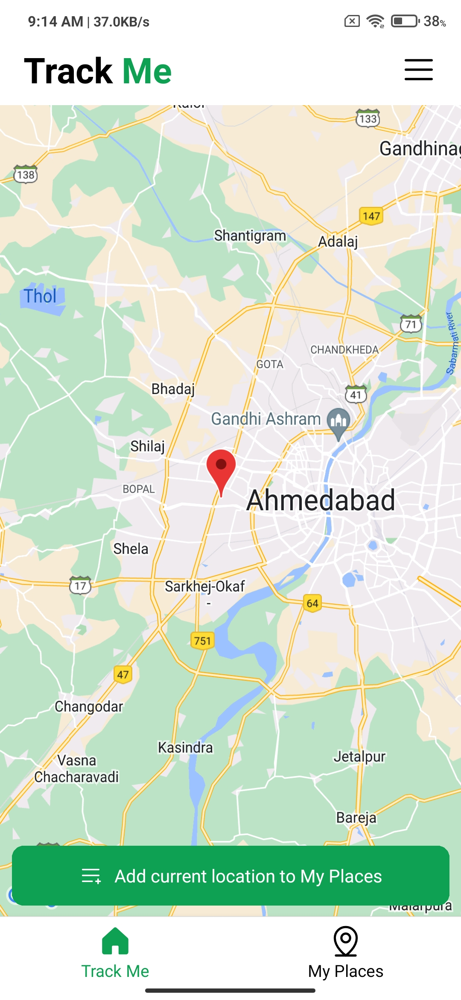
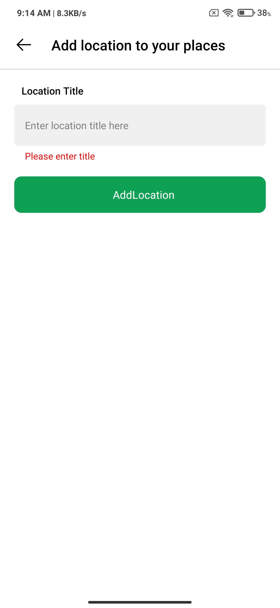
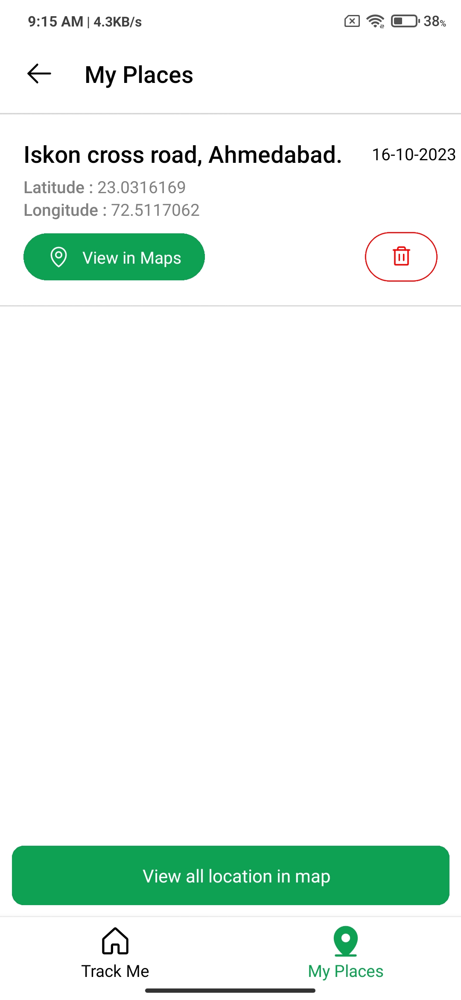
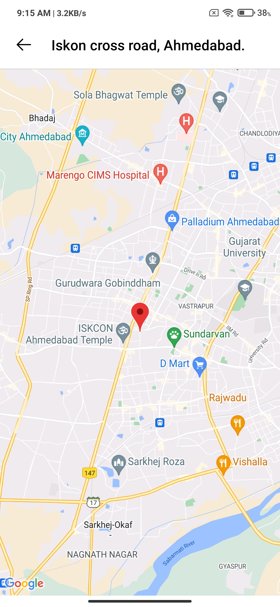
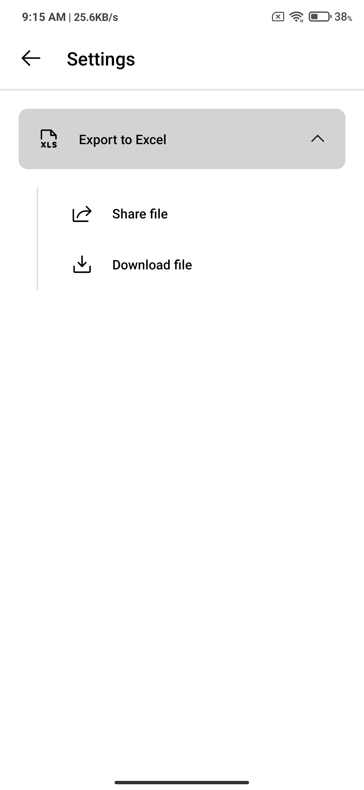

# rn-assignment

**Project Name**: `Track Me`

## About Track Me

-  Track Me is a mobile application which always shows your current location (dynamic).
-  User can save current location to keeps track of their entire journey.
-  Later on they can open single or all location at a time in maps.
-  They can export (Share/Download) all location data including title, longitude, latitude, timestamp in excel file (.xslx).

New to Track Me

-  You can enable and disable background location tracking
-  You can also can set interval for location tracking in background

## How to Run the Project

Please add google map key at blow locations

   - For Android
   
      Find AdroidManifest.xml and replace your google api key with [YOUR-GOOGLE-MAP-KEY]
   
   - For iOS
   
      Find AppDeledate.mm and replace your google api key with [YOUR-GOOGLE-MAP-KEY]

1. Open the project directory in to terminal

2. Install all dependencies
   
   - Run below command

     npm install

   - Install pods (Only for iOS)

     npx pod-install
   
2. Run and build for either OS

   - Run iOS app
     
     npx react-native run-ios

   - Run Android app
 
     npx react-native run-android

   - Note: Make sure you have already install node.js and react native on your machine.

## List of all dependencies used in the project with their usage

List all dependencies from the package.json file along with their usage. This list must be updated every time you change/add any dependecy. Here are some examples:

- **Framework:**

  - [react-native](https://github.com/facebook/react-native)
    [react](https://github.com/facebook/react)
  
- **State management libraries:**

  - [redux](http://redux.js.org/), 
    [react-redux](https://react-redux.js.org/), 
    [redux-persist](https://github.com/rt2zz/redux-persist), 
    [@reduxjs/toolkit](https://redux-toolkit.js.org/)

- **Icons:**

  - [phosphor-react-native](https://github.com/duongdev/phosphor-react-native),

- **SVG Support:**

  - [react-native-svg](https://github.com/software-mansion/react-native-svg),

- **Storage:**

  - [@react-native-async-storage/async-storage](https://github.com/react-native-async-storage/async-storage),

- **Animation:**

  - [react-native-reanimated](https://github.com/software-mansion/react-native-reanimated),

- **Navigation:**

  - [react-native-gesture-handler](https://github.com/kmagiera/react-native-gesture-handler),
    [react-native-safe-area-context](https://github.com/th3rdwave/react-native-safe-area-context)
    [@react-native-masked-view/masked-view](https://github.com/react-native-masked-view/masked-view)
    [@react-navigation/bottom-tabs](https://github.com/react-navigation/react-navigation)
    [@react-navigation/native](https://github.com/react-navigation/react-navigation)
    [@react-navigation/stack](https://github.com/react-navigation/react-navigation)

- **Geolocation Service:**

  - [@react-native-community/geolocation](https://github.com/michalchudziak/react-native-geolocation)

- **Map Visulization:**

  - [react-native-maps](https://github.com/react-native-maps/react-native-maps)

- **File Saving and Sharing:**

  - [xlsx](https://github.com/SheetJS/sheetjs)
  - [react-native-share](https://github.com/react-native-community/react-native-share)
  - [react-native-fs](https://github.com/itinance/react-native-fs)

- **Permissions:**

  - [react-native-permissions](https://github.com/zoontek/react-native-permissions)

- **Background Task:**

  - [react-native-background-actions](https://github.com/Rapsssito/react-native-background-actions)

